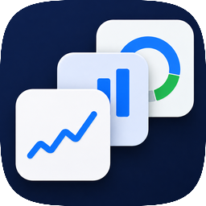

  

<h1 align="center">Money Board Plus</h1>

  Private budgeting for iPhone.

---

Money Board Plus is a personal-finance app for iPhone. Track spending, set monthly budgets, and work toward savings goals on a home board you arrange yourself. There is no account and no tracking — your data stays on your iPhone and syncs through your own private iCloud.

This repository holds the app's marketing, legal, and support website, published with GitHub Pages.

  <a href="https://denyslebiediev.github.io/moneyboardplus/">Website</a> · <a href="https://apps.apple.com/app/id6774750345">App Store</a> · <a href="mailto:moneyboardplus.help@gmail.com">Support</a>

© 2026 Denys Lebiediev

